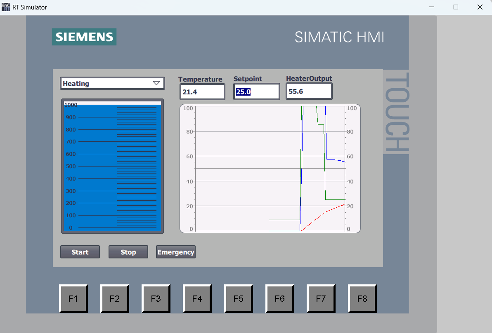

# Mixing Tank Automation System

## Overview

This project is a simulation of an industrial mixing tank automated using Siemens TIA Portal. The system controls the complete production cycle of a batch process including filling, heating, mixing, and draining.

The project was developed as a PLC automation portfolio project and demonstrates the use of several common industrial automation technologies.

## Features

- Sequential control using GRAPH (SFC/Grafcet)
- Automatic filling 
- Temperature control using PID_Compact
- Mixing process 
- Automatic tank draining
- Start, Stop, and Emergency functions
- WinCC HMI visualization
- Process simulation using PLCSIM

## Process Sequence

1. Wait for Start command
2. Fill Components 
3. Heat the mixture to the desired temperature
4. Mix for the specified time
5. Drain the tank
6. Return to Idle state

## HMI Functions

The operator can:

- Start and stop the process
- Activate Emergency Stop
- Set the temperature setpoint
- Monitor tank level
- Monitor temperature
- View the current process step

## Technologies Used

- Siemens TIA Portal
- Siemens GRAPH (SFC)
- Function Block Diagram (FBD)
- Structured Text (ST)
- PID_Compact
- WinCC HMI
- PLCSIM

## Simulated Equipment

### Sensors

- Tank level sensor
- Temperature sensor

### Actuators

- Component A inlet valve
- Component B inlet valve
- Mixer motor
- Heater
- Drain valve

## Project Structure

- GRAPH – process sequence control
- FBD – actuator control logic
- ST – calculations and simulation logic
- PID_Compact – temperature regulation
- WinCC – operator interface

## Screenshots

### HMI Interface

